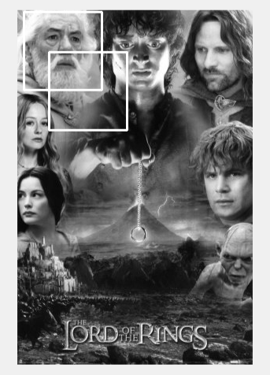

 

  

  <h3 align="center">Face Detection Algorithms</h3>

  

     Created by Dakota Holmes, Joseph Mancillas, & Marquiese Thompson
  

<!-- ABOUT THE PROJECT -->
## About The Project

The purpose of this project, we create a face detector algorithm that is trained using Adaboost which combines information from taking integrals of each image and choosing a set of random weak classifiers whose size is realitive to the amount of images being use.  
 
  

 
 

### Built With

* [Matlab](https://www.mathworks.com/?s_tid=mlh_gn_logo)

## Usage

 Below we have screenshots of successful classified faces and nonsuccessful classified faces in multiple images. 
  

  
 
 
  
 
<!-- CONTACT -->
## Contact

Dakota Holmes - holmesdakota28@gmail.com

<!-- MARKDOWN LINKS & IMAGES -->
<!-- https://www.markdownguide.org/basic-syntax/#reference-style-links -->
[contributors-shield]: https://img.shields.io/github/contributors/othneildrew/Best-README-Template.svg?style=for-the-badge
[contributors-url]: https://github.com/othneildrew/Best-README-Template/graphs/contributors
[forks-shield]: https://img.shields.io/github/forks/othneildrew/Best-README-Template.svg?style=for-the-badge
[forks-url]: https://github.com/othneildrew/Best-README-Template/network/members
[stars-shield]: https://img.shields.io/github/stars/othneildrew/Best-README-Template.svg?style=for-the-badge
[stars-url]: https://github.com/othneildrew/Best-README-Template/stargazers
[issues-shield]: https://img.shields.io/github/issues/othneildrew/Best-README-Template.svg?style=for-the-badge
[issues-url]: https://github.com/othneildrew/Best-README-Template/issues
[license-shield]: https://img.shields.io/github/license/othneildrew/Best-README-Template.svg?style=for-the-badge
[license-url]: https://github.com/othneildrew/Best-README-Template/blob/master/LICENSE.txt
[linkedin-shield]: https://img.shields.io/badge/-LinkedIn-black.svg?style=for-the-badge&logo=linkedin&colorB=555
[linkedin-url]: https://linkedin.com/in/othneildrew
[product-screenshot]: images/screenshot.png
